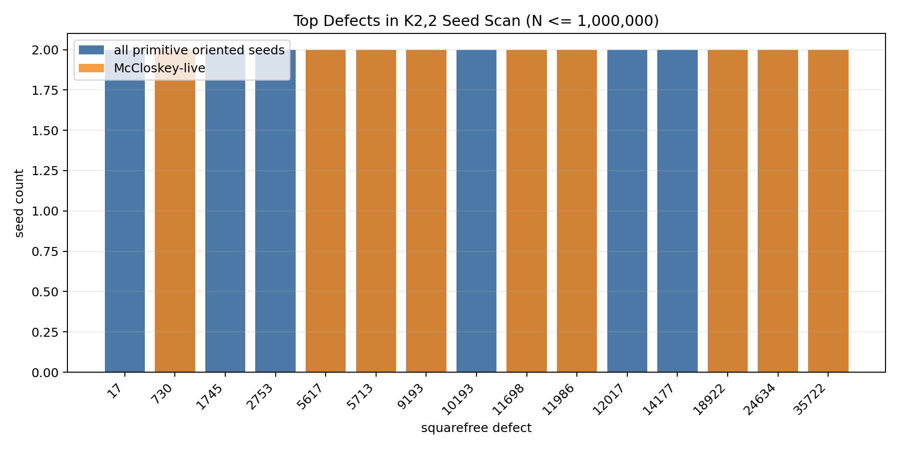
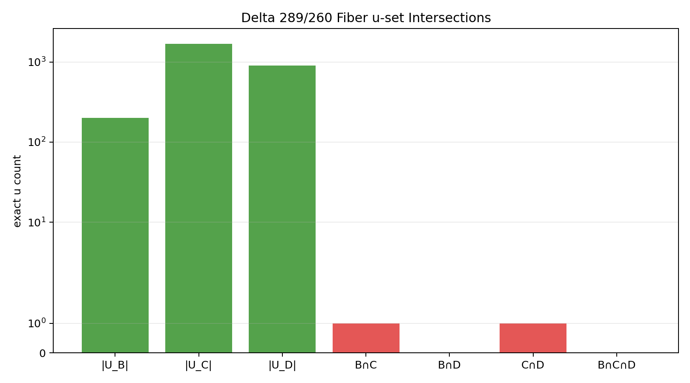
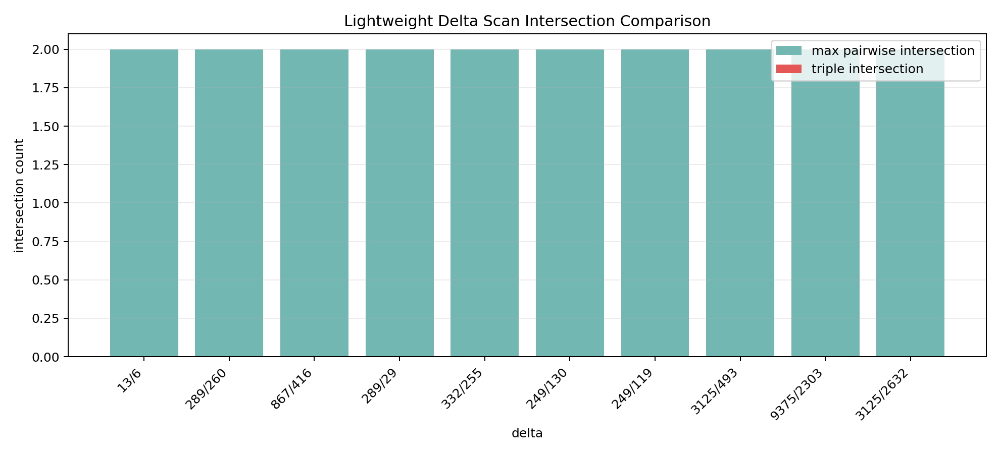

# Unit Square Four-Distance (Exact Computational Study)

Python: 3.10-3.13  
SageMath: 10.7  
Tests: passing (37/37)

This repository implements a fully reproducible exact-arithmetic search
framework for the unit square four-distance problem.

Main result:

- No true four-distance solution found in:
  - K2,2 search up to `N <= 10^6`
  - `delta = 289/260` Mordell-Weil fiber search
  - lightweight scan of 10 delta slices
- No triple fiber intersection detected
- Best live obstruction remains `defect = 730`

Important:

This is computational evidence, not a proof of non-existence.

The central question is whether there is a point inside the unit square whose
distances to all four vertices are rational.  This codebase does not claim a
proof or a solution.  It provides reproducible searches, Sage fiber experiments,
CSV outputs, tests, and reports that can be reviewed and rerun.

## Quick Result

- Problem reduced to slope closure:
  `A*C = B*D = A+B-1`
- Fixed delta slice analysis (`delta=289/260`):
  - `U_B ∩ U_C = {3/5}`
  - `U_C ∩ U_D = {15/26}`
  - `U_B ∩ U_D = empty`
  - triple intersection = `empty`
- Pattern holds across multiple delta slices

Interpretation:

Strong finite evidence of structural sparsity in rational solutions.

## Visual Summary







Primary module:

- `research/four_distance/`
- `research/asg_bcd_formula/` for the standalone exact B/C/D formula pack

Start with:

```bash
pytest research/four_distance/tests -q
pytest research/asg_bcd_formula/tests -q
python research/four_distance/fiber_intersection_search.py --delta 289/260
python research/four_distance/delta_scan_lite.py --dry-run --max-deltas 1
```

Sage-dependent runs require SageMath.  On this workstation Sage is available in
the WSL Miniforge `sage` conda environment.

```bash
sage research/four_distance/sage_fiber_rank.sage --delta 289/260 --all --max-multiple 100 --combo-bound 20 --strategic-only --sieve-primes 2000
python research/four_distance/sage_fiber_bridge.py --from-sage-csv research/four_distance/data/sage_fiber_points.csv --strategic-only --sieve-primes 2000
```

Current finite result: no true four-distance solution was found in the recorded
K2,2 scans, the delta `289/260` Mordell-Weil/fiber run, or the lightweight
delta scan.  This is not a proof of non-existence.

## Current Checkpoint

The project has a reproducible four-distance exact arithmetic artifact under
`research/four_distance`.  The recorded finite runs found no true solution, no
triple fiber intersection, and no improvement over the 730 live seed.  This is
computational evidence only, not a proof.

## ASG/BCD Formula Export

The public formula pack under `research/asg_bcd_formula` exports the exact
Fraction/int version of the B/C/D relations discussed in the study:

```text
A*C = B*D = A+B-1
A = 2u/(1-u^2)
B = A*(delta-1)
C = delta - 1/A
D = (A*delta - 1)/(A*(delta-1))
P = (1/(A*delta), 1/delta)
```

It includes exact defect checks for the three conditions `B in S`, `C in S`,
and `D in S`, where `S = {a/b : a^2+b^2 is a square}`.

Known exported examples:

- `delta=289/260, u=3/5` gives defects `(1,1,730)` and
  `P=(416/867,260/289)`.
- `delta=289/260, u=15/26` gives defects `(730,1,1)` and
  `P=(451/867,260/289)`.
- `delta=13/6, u=1/4` gives defects `(1,1,17)` and
  `P=(45/52,6/13)`.

This is a reusable formula artifact only.  It does not include trading runtime
code, credentials, private telemetry, or any claim of solving the problem.
